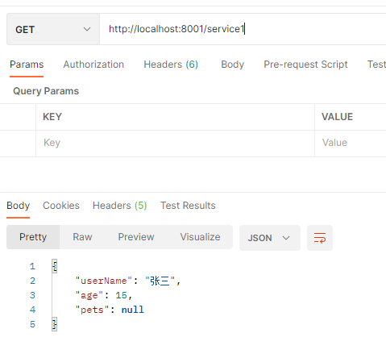
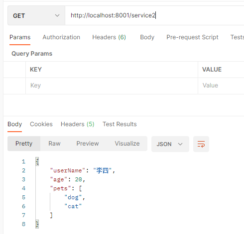

# Dubbo框架

官网地址：[https://dubbo.apache.org/zh/docs/introduction/](https://dubbo.apache.org/zh/docs/introduction/)

## 一、简介

Apache Dubbo 是一款微服务开发框架，它提供了 **RPC**通信 与 微服务治理 两大关键能力。这意味着，使用 Dubbo 开发的微服务，将具备相互之间的远程发现与通信能力， 同时利用 Dubbo 提供的丰富服务治理能力，可以实现诸如**服务发现、负载均衡、流量调度**等服务治理诉求。同时 Dubbo 是高度可扩展的，用户几乎可以在任意功能点去定制自己的实现，以改变框架的默认行为来满足自己的业务需求。


## 二、开发

基本架构如下图：


### 2.1 项目结构

在官方推荐中，建议使用如下项目结构：

1. 服务提供者（Provider）：为一个web工程，实现了接口（即提供了具体的实现方法）；
2. 服务消费者（Consumer）：为一个web工程，根据服务提供者的接口，调用其服务；
3. 接口工程（api）：为一个java工程，维护了服务提供者的接口和实体类。

### 2.2 服务注册中心

服务注册中心：对应上图中的Registry，将服务提供者、消费者的信息注册到Registry中，通过注册中心来协调服务发现过程。

Dubbo官方推荐使用Zookeeper作为服务注册中心。

官网地址：[http://zookeeper.apache.org/](http://zookeeper.apache.org/)

下载解压之后，修改/conf/zoo_sample.cfg  为 zoo.cfg即可；

linux启动： 

````shell
/bin/zkServer.sh start
````

### 2.3 模块结构

- API模块：主要提供服务接口。

  所需依赖：

  ```xml
  <dependency>
      <groupId>org.projectlombok</groupId>
      <artifactId>lombok</artifactId>
      <version>1.18.20</version>
  </dependency>
  ```

  接口：

  ```java
  public interface UserService {
      User getUser();
  }
  ```

  实体类：注意需要序列化，否则会失败。

  ```java
  @Data
  @AllArgsConstructor
  @NoArgsConstructor
  @ToString
  public class User implements Serializable {
      private String name;
      private int age;
      private List<String> hobby;
  }
  ```

- Consumer模块：消费者模块，调用接口并发送请求至服务提供者。

  依赖：

  ```xml
  <!--springboot依赖、mvc依赖、接口模块依赖这里省略。注意添加-->
  <!--dubbo依赖-->
  <dependency>
      <groupId>org.apache.dubbo</groupId>
      <artifactId>dubbo-spring-boot-starter</artifactId>
      <version>3.0.3</version>
  </dependency>
  <!--zk依赖-->
  <dependency>
      <groupId>org.apache.dubbo</groupId>
      <artifactId>dubbo-dependencies-zookeeper</artifactId>
      <version>3.0.3</version>
      <type>pom</type>
      <exclusions>
          <exclusion>
              <artifactId>slf4j-log4j12</artifactId>
              <groupId>org.slf4j</groupId>
          </exclusion>
      </exclusions>
  </dependency>
  ```

  controller：

  ```java
  @RestController
  public class UserController {
      // 注意该注解是dubbo的注解
      @DubboReference
      private UserService userService;
  
      @RequestMapping("/user")
      public User getUser(){
          return userService.getUser();
      }
  }
  ```

  **配置文件**：

  ```xml
  server:
    port: 8001
  spring:
    application:
      name: consumer
  # dubbo 相关配置
  dubbo:
    application:
      name: consumer
    registry:
      address: zookeeper://192.168.1.222:2181
      timeout: 35000
    protocol:
      # 协议名称
      name: dubbo
      # 协议端口
      port: 20880
  #启动应用时是否检查注册中心上有没有依赖的服务，默认true
  #dubbo.consumer.check=false
  ```

- Provider：服务提供者，主要是对接口的实现。

  依赖：同Consumer。

  实现类：

  ```java
  // 注意该注解是dubbo的注解，而不是spring的注解
  @DubboService
  public class UserServiceImpl implements UserService {
      @Override
      public User getUser() {
          return new User("张三", 15, null);
      }
  }
  ```

  配置文件：

  ```yml
  server:
    port: 8002
  
  spring:
    application:
      name: provider
  # dubbo 相关配置(dubbo 的配置不再以 Spring 开头)
  dubbo:
    application:
      # 应用名称
      name: provider
    scan:
      # 接口实现者（服务实现）包
      base-packages: com.zjj.dubbo.provider.serviceImpl
    # 注册中心信息
    registry:
      address: zookeeper://192.168.1.222:2181
      # 连接超时时间，建议大一点否则会连接失败
      timeout: 35000
    protocol:
      # 协议名称
      name: dubbo
      # 协议端口
      port: 20880
  ```

完整Demo地址：[https://github.com/wuraoo/springboot-demo](https://github.com/wuraoo/springboot-demo)

配置及注解可查看官网：[https://dubbo.apache.org/zh/docs/references/configuration/annotation/](https://dubbo.apache.org/zh/docs/references/configuration/annotation/)


## 三、高级用法

官网文档：[https://dubbo.apache.org/zh/docs/advanced/](https://dubbo.apache.org/zh/docs/advanced/)

### 3.1 启动时检查

在启动时检查依赖的服务是否可用，不可用会抛出异常，使spring初始化失败无法启动，以便发现问题默认为true。

但是在有些时候，比如开发中，如果服务提供方没有准备好，这时就需要将其设置为false，否则无法启动。

在SpringBoot中的配置：

```properties
# 关闭某个服务的启动时检查 (没有提供者时报错)：
dubbo.reference.com.foo.BarService.check=false
# 关闭所有服务的启动时检查 (没有提供者时报错)：
dubbo.consumer.check=false
# 关闭注册中心启动时检查 (注册订阅失败时报错)：
dubbo.registry.check=false
```

### 3.2 多版本

由于Dubbo是根据接口实现请求。所以一个接口可以又多个实现类，如何确定使用的是哪一个实现类就需要解决。所以使用到了多版本。

在Springboot中，使用注解开发很方便，只需要在服务提供者的实现类的`@Service`注解中指定version参数；在消费者的Controller中的`@Reference`注解中指定要使用哪个版本号即可。

具体示例如下：

- 实现类1：

  ```java
  // 注意给注解是dubbo的注解，而不应是spring的注解
  // version为版本，在消费者处根据版本号调用
  @DubboService(version = "userService1")
  public class UserServiceImpl implements UserService {
      @Override
      public User getUser() {
          return new User("张三",15,null);
      }
  }
  ```

- 实现类2：

  ```java
  @DubboService(version = "userService2")
  public class UserServiceImpl2 implements UserService {
      @Override
      public User getUser() {
          User user = new User();
          user.setUserName("李四");
          user.setAge(20);
          List<String> list = new ArrayList<>();
          list.add("dog");
          list.add("cat");
          return new User("李四", 20, list);
      }
  }
  ```

- 消费者：

  ```java
  @RestController
  public class HelloController {
      // 根据version确定调用的是实现类
      @DubboReference(version = "userService1")
      private UserService userService1;
  	
      @DubboReference(version = "userService2")
      
      private UserService userService2;
  	// 使用第一个版本
      @RequestMapping("/service1")
      public User service1(){
          return userService1.getUser();
      }
  	// 使用第二个版本
      @RequestMapping("/service2")
      public User service2(){
          return userService2.getUser();
      }
  ```

- 测试：

  

  

### 3.3 负载均衡

为保证一个服务有多个提供者的时候（集群）各个服务提供者的压力均分，Dubbo提供了负载均衡策略。

在Dubbo中内置的算法有如下5种：

1. **加权随机（Random）**：按权重随机概率。

   优点：分配较均匀。

   缺点：慢的服务提供者会导致请求累积。

2. **加权轮询（RoundRobin）**：按公约后的权重设置轮询比率，循环调用节点。

   缺点：同样存在慢服务累积问题。

3. **加权最少活跃优先（LeastActive）**：活跃段度最低的优先调用。

4. **加权最短响应优先（ShortestResponse）**：在一个滑动窗口中，响应时间最短的优先调用。

5. **一致性Hash（ConsistentHash）**：相同参数的请求总是发到同一个提供者。

使用：在主语注解开发中，只需要在`@DubboService`或`@DubboReference`中的loadbalance参数设置即可。如下：（复制一个相同的provider模块）

```java
@DubboService(version = "userService1",loadbalance = "random")
public class UserServiceImpl implements UserService {
    @Override
    public User getUser() {
        return new User("provider2", 2, null);
    }
}
```

### 3.4 集群容错

Dubbo有如下的几种集群容错机制：

- Failover Cluster：默认。失败时自动切换，当出现失败的时候重试其他服务器。但是重试会带来更长的延时。可以设置重试次数。
- Failfast Cluster：快速失败，只发起一次调用，失败立即报错。通常用于非幂等性（幂等性：一次操作于多次操作的影响一样）操作，如新增操作。
- Failsafe Cluster：快速失败，出现异常时直接忽略。通常用于日志。
- Failback Cluster：失败自动恢复，后台记录失败请求，定时重发。通常用于消息通知机制。
- Forking Cluster：并行调用多个服务器，只要有一个成功即返回。用于实时性较高的读操作。
- Broadcast Cluster：广播调用所有提供者，逐个调用，任意一台报错则报错。通常用于通知所有提供者更新缓存或日志。
- Available Cluster：调用目前可用的实例（只调用一个），如果没有实例可用就抛出异常。
- Mergeable Cluster
- ZoneAware Cluster


