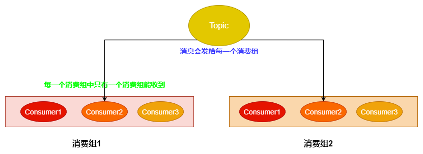
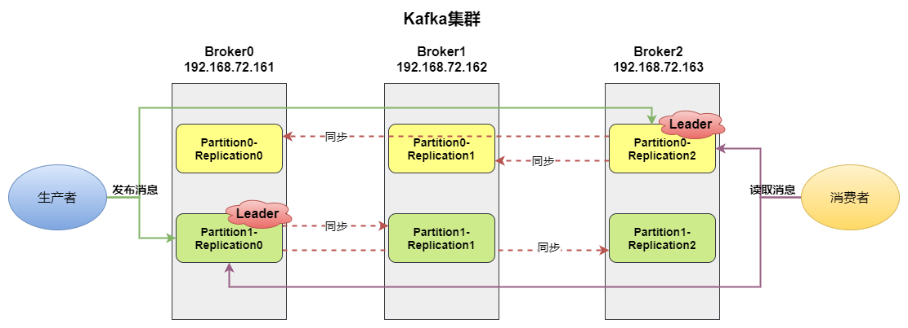

# Kafka

官网地址：https://kafka.apache.org/documentation/

## 一、概述

### 1.1 环境准备

事前需要准备：JDK环境、Zookeeper环境。

Kafka[👉下载地址](https://kafka.apache.org/downloads)，下载完成后上传解压即可。

启动（后台）：

````shell
./bin/kafka-server-start.sh -daemon ./config/server.properties
````

### 1.2  基本概念

Broker：消息中间处理节点，一个Kafka节点就是一个broker，一个或多个broker可以组成一个集群。

Topic：Kafka是一个重Tpoic的MQ，因此每一条消息都需要指定一个topic；Topic可以对消息进行分类。

Producer：生产者，是MQ中的基本角色，用于向broker发送消息。

Consumer：消费者，是MQ中的基本角色，用于读取boker中消息。


### 1.3 基本操作

[👉参考地址](https://kafka.apache.org/documentation/#basic_ops)

> 创建主题

```shell
bin/kafka-topics.sh --create --partitions 1 --replication-factor 1 --topic myTest --zookeeper localhost:2181
```

创建完成后可以在Zookeeper的/brokers/topics中看到myTest的主题

> 查看所有主题

````shell
bin/kafka-topics.sh --list --zookeeper localhost:2181
````

> 在Topic中写入消息

```shell
 bin/kafka-console-producer.sh  --topic myTest --bootstrap-server localhost:9092
```

启动之后就会出现控制台，可以向主题中写入消息。

> 读取Topic中的消息

```shell
# 从头开始消费
bin/kafka-console-consumer.sh --topic myTest --from-beginning --bootstrap-server localhost:9092
# 从最后一条消息的偏移量+1开始消费
bin/kafka-console-consumer.sh --topic myTest --bootstrap-server localhost:9092
```

启动之后就会开始读取主题中的消息。

### 1.4 消息特点

在kafka中，其消息与其他常规的MQ有却别，如下：

- Kafka中的消息会被持久化，所以**消息可以被消费者读取任意多次**
- 消息消费的时候根据**偏移量**来判断从哪里开始消费
- 消息持久化的位置为：/config/server.properties文件中的log.dirs选择指定的目录下。

**单播消息：**同一个<u>消费组</u>中只有一个<u>消费者</u>能够消费一个Topic中的消息。也就是一个Topic中的消息对于一个消费组来说不是广播的。

**多播消息：**反之，一个Topic中的消息可以广播到每一个消费组。



### 1.5主题与分区

在Kafka中，由于消息会被持久化，所以一个Topic中消息的存储文件可能会变得非常大，因而变得不易维护和查询。

于是，提出了Partition（分区）的概念：将主题分为多个区域，消息便会根据event key决定写在哪个分区中。

通过查看数据持久的目录可以看到：分了几个区就会创建几个目录。

优势：

- 避免一个文件过大。
- 允许客户端同时读取或写入数据。
- 将相同key的事件写入同一个分区。
- 保证任何消费者将始终以与写入数据完全相同的顺序读该分区的是消息。

如官网图所示：


`注意`：在主题目录下可以看到默认有50个__consumer_offsets分区，这些分区记录了每一个消费组下每一个消费组的消费记录（偏移量），以便于出现故障的时候能够快速恢复，提高并发性和效率。

## 二、集群

### 2.1 集群搭建

准备三个Kafka的服务器：

- 192.168.72.161
- 192.168.72.162
- 192.168.72.163

修改每个的配置文件/config/server-properties

````properties
broker.id=0   #0/1/2三台集群
listeners=PLAINTEXT://192.168.72.163:9092
#zookeeper可以使用集群
zookeeper.connect=192.168.72.161:2181 
````

分别启动三个服务器，查看zookeeper中的/broker/ids判断集群是否启动

```shell
[zk: localhost:2181(CONNECTED) 4] ls /brokers/ids
[0, 1, 2]
```

### 2.2 集群中的主题

首先在集群下创建一个主题：名称为my-topic，两个分区，三个副本。

```shell
/bin/kafka-topics.sh --create --zookeeper 192.168.72.161:2181 --replication-factor 3 --partitions 2 --topic my-topic
```

查看主题的具体信息：

```shell
 bin/kafka-topics.sh --describe --zookeeper 192.168.72.161:2181 --topic my-topic
```

显示结果如下：

```shell
Topic: my-topic TopicId: WA4oVzcAS4qU4Zs0J1A-tw PartitionCount: 2       ReplicationFactor: 3    Configs: 
        Topic: my-topic Partition: 0    Leader: 2       Replicas: 2,1,0 Isr: 2,1,0
        Topic: my-topic Partition: 1    Leader: 0       Replicas: 0,2,1 Isr: 0,2,1

```

**解析**：

- Topic：主题名称
- TopicId：主题ID
- PartitionCount：分区数量
- ReplicationFactor：副本数量（副本可以理解为备份）
- Configs：配置信息：
  - Partition：分区编号
  - Leader：副本的Leader所在的broker，读写都在Leader上执行
  - Replicas：在哪些broker中有该分区的副本
  - Isr：副本同步集合，只有已经被同步的副本才会加入到次集合中；当Leader宕机后汇总该集合中选举一个新的作为Leader

如图所示：



### 2.3 集群中的消息

> 集群消息发送

````shell
bin/kafka-console-producer.sh --broker-list 192.168.72.161:9092,192.168.72.162:9092,192.168.72.163:9092 --topic my-topic
````

> 集群消息接收

```shell
bin/kafka-console-consumer.sh --bootstrap-server 192.168.72.161:9092,192.168.72.162:9092,192.168.72.163:9092 --from-beginning --topic my-topic
```

> 创建消费组

```shell
bin/kafka-console-consumer.sh --bootstrap-server 192.168.72.161:9092,192.168.72.162:9092,192.168.72.163:9092 --consumer-property group.id=MyGroup1 --from-beginning --topic my-topic
```

`注意：`

- 在broker中的一个partition只能被一个消费组中的一个消费组消费，来**保证消息的消费顺序**。
- 对于一个partition来说消费顺序是保证的，但是对于一个有多个partition的topic来说，不保证顺序。


## 三、java客户端操作

```xml
<dependency>
    <groupId>com.alibaba</groupId>
    <artifactId>fastjson</artifactId>
    <version>1.2.73</version>
</dependency>
```

### 3.1生产者实现

[👉Producer相关配置](https://kafka.apache.org/28/documentation.html#producerconfigs)

```java
/**
 * 生产者
 */
public class Producer {
    private static String TOPIC = "my-topic";
    private static String cluster = "192.168.72.161:9092,192.168.72.162:9092,192.168.72.163:9092";

    public static void main(String[] args) throws ExecutionException, InterruptedException {
        CountDownLatch countDownLatch = new CountDownLatch(1);
        Properties properties = new Properties();
        // 以下配置可在官网查看
        // 连接地址
        properties.put(ProducerConfig.BOOTSTRAP_SERVERS_CONFIG, cluster);
        // key的序列化
        properties.put(ProducerConfig.KEY_SERIALIZER_CLASS_CONFIG, StringSerializer.class.getName());
        // value的序列化
        properties.put(ProducerConfig.VALUE_SERIALIZER_CLASS_CONFIG, StringSerializer.class.getName());
        /**
         * 消息发送确认：
         *         0：发送后直接确认
         *         1：Leader副本写完成后返回确认
         *         -1/all：由Leader同步副本完成后返回确认，在配置文件中：min.insync.replicas设置需要同步的副本数
         */
        properties.put(ProducerConfig.ACKS_CONFIG, "1");
        // 设置重试次数
        properties.put(ProducerConfig.RETRIES_CONFIG, 3);
        // 重试间隔时间：ms
        properties.put(ProducerConfig.RETRY_BACKOFF_MS_CONFIG, 200);
        /**
         *    消息缓冲区机制：
         *      BUFFER_MEMORY_CONFIG：创建一个32M的缓冲区用于存放将要发送的消息
         *      BATCH_SIZE_CONFIG：批量发送，每次取16k的消息进行发送
         *      LINGER_MS_CONFIG：如果缓冲区中没有16k的数据，则10ms后自动发送这些不足16k的消息
         */
        properties.put(ProducerConfig.BUFFER_MEMORY_CONFIG, 33554432);
        properties.put(ProducerConfig.BATCH_SIZE_CONFIG, 16384);
        properties.put(ProducerConfig.LINGER_MS_CONFIG, 10);
        
        // 创建Producer的客户端
        KafkaProducer<String, String> producer = new KafkaProducer<>(properties);
        // 构建消息
        User user = new User(1, "张三");
        /**
         * 构建消息：
         *      参数一：发送消息的主题
         *      参数二：指定将消息发送到哪个分区
         *      参数三：如果没有参数二，则用于计算发送到哪个分区 hash(key)%分区数
         *      参数四：实际发送的消息内容
         */
        ProducerRecord<String, String> record = new ProducerRecord<>(TOPIC, 1, user.getId().toString(), JSON.toJSONString(user));
        
        /**
        // 同步发消息发送消息，在get()方法出会阻塞等待
        Future<RecordMetadata> metadataFuture = producer.send(record);
        RecordMetadata recordMetadata = metadataFuture.get();
        System.out.println(recordMetadata.topic() + " | partition：" + recordMetadata.partition());
        **/
        
        // 异步发送消息
        producer.send(record, new Callback() {
            @Override
            public void onCompletion(RecordMetadata recordMetadata, Exception e) {
                // 异常
                if (e != null){
                    System.out.println("发送失败，原因：" + e.getMessage());
                }
                // 成功
                if (recordMetadata != null){
                    System.out.println(recordMetadata.topic() + " | partition：" + recordMetadata.partition());
                }
                // 计数器减，通知主线线程继续
                countDownLatch.countDown();
            }
        });
        // 主线程等待消息发送完成
        countDownLatch.await();
    }
}
```

**注意点：**

- 消息发送确认：0、1、-1三种情况
- 消息缓冲区：消息批量发送
- 同步发送/异步发送：同步会阻塞，异步使用回调函数。

### 3.2 消费者实现

[👉Consumer相关配置](https://kafka.apache.org/28/documentation.html#consumerconfigs)

````java
/**
 * 消费者
 */
public class Consumer {
    private static String TOPIC = "my-topic";
    private static String CONSUMER_GROUP_NAME = "group1";
    private static String cluster = "192.168.72.161:9092,192.168.72.162:9092,192.168.72.163:9092";

    public static void main(String[] args) {
        Properties properties = new Properties();
        // 以下配置可在官网查看
        // 连接地址
        properties.put(ConsumerConfig.BOOTSTRAP_SERVERS_CONFIG, cluster);
        // 消费组名称
        properties.put(ConsumerConfig.GROUP_ID_CONFIG, CONSUMER_GROUP_NAME);
        properties.put(ConsumerConfig.KEY_DESERIALIZER_CLASS_CONFIG, StringDeserializer.class.getName());
        properties.put(ConsumerConfig.VALUE_DESERIALIZER_CLASS_CONFIG, StringDeserializer.class.getName());
        // poll拉取消息相关配置
        // 一次拉取最多的消息数量
        properties.put(ConsumerConfig.MAX_POLL_RECORDS_CONFIG, 100);
        // 如果消费100条消息如果超过10s，则将该消费者剔除
        properties.put(ConsumerConfig.MAX_POLL_INTERVAL_MS_CONFIG, 10*1000);
        // 消费者健康检查
        // 每10s向broker发送一次心跳
        properties.put(ConsumerConfig.HEARTBEAT_INTERVAL_MS_CONFIG, 1000);
        // 10s内没有收到心跳就剔除该消费者，进行rebalance
        properties.put(ConsumerConfig.SESSION_TIMEOUT_MS_CONFIG, 10000);

        /**
        // 自动提交offset：默认  注意自动调教可能会有消息丢失
        properties.put(ConsumerConfig.ENABLE_AUTO_COMMIT_CONFIG, "true");
        // 自动提交offset的时间间隔
        properties.put(ConsumerConfig.AUTO_COMMIT_INTERVAL_MS_CONFIG, "1000");
        **/
        // 手动提交
        properties.put(ConsumerConfig.ENABLE_AUTO_COMMIT_CONFIG, "false");

        // 创建消费组客户端
        KafkaConsumer<String, String> consumer = new KafkaConsumer<>(properties);
        // 订阅的主题
         consumer.subscribe(Arrays.asList(TOPIC));

        /**
         // 回溯消费（从头开始）
        consumer.assign(Arrays.asList(new TopicPartition(TOPIC,1)));
        consumer.seekToBeginning(Arrays.asList(new TopicPartition(TOPIC,1)));
        */

        // 轮询拉取消息
        while(true){
            /**
             * 如果1000ms拉取时间：（拉取的数量由上面配置）
             *          - 没有拉取到100条消息，则进入下一个循环
             *          - 拉取到不足100消息，直接消费这些消息
             *          - 拉取到100条消息，直接消费
             */
            ConsumerRecords<String, String> records = consumer.poll(Duration.ofMillis(1000));
            // 消费消息
            for (ConsumerRecord<String,String> record : records){
                System.out.println("接收到消息：" + record.value() + "\tpartition:" + record.partition() + "\toffset:" + record.offset());
            }

            // 消费完成，手动提交需要执行以下代码进行提交
            if(records.count() > 0){
                // 同步提交   会被阻塞，当提交成功之后再执行后续操作
                consumer.commitSync();

                /**
                // 异步提交   不会阻塞，提交成功后调用回调函数
                consumer.commitAsync(new OffsetCommitCallback() {
                    @Override
                    public void onComplete(Map<TopicPartition, OffsetAndMetadata> map, Exception e) {
                        if (e != null){
                            System.out.println("提交失败，原因如下：" + e.getMessage());
                        }
                    }
                });
                **/
            }
        }
    }
}
````

**注意点：**

- 消费者消息提交：提交的是offset，标识消费者消费到了那条消息。
  - 自动提交：当消费者poll消息之后直接提交offset
  - 手动提交：当消息消费完成之后再提交offset
    - 同步：commitSync()会阻塞
    - 异步：commitAsync()不会阻塞
- 新消费组默认只消费启动之后发布到topic的消息。


## 四、SpringBoot整合

[👉Spring官网介绍](https://docs.spring.io/spring-boot/docs/current/reference/html/messaging.html#messaging.kafka)

关注点:

- 需要配置的内容
- 生产者的实现
- 是消费者的实现

[👉Demo见Github]()


## 五、扩展

### 5.1 Controller

Kafka集群中的各个broler会在Zookeeper中创建临时序号节点（带序号的Znode），序号最小的Znode（最先创建）的节点就是Kafka集群的Controller。其作用**负责管理整个集群中的所有分区和副本状态。**

具体体现在：

- 当某个分区的Leader副本出现故障后，就由Controller负责从ISR集合中（ISR集合见2.2）选择一个新的副本作为Leader
- 当新增或减少副本（即ISR集合发生变化）时，由Controller负责通知所有broker更新元数据信息
- 当Topic新增分区的时候，由Controller通知所有broker更新数据信息。


### 5.2 Rebalance机制

在Kafka集群中，当消费组中的消费者与分区的关系发生变化的时候（新增消费者、剔除消费者、分区发生变化）就会触发Rebalance机制。但**前提是：消费者没有指定消费分区。**

所谓Rebalance机制就是重新调整消费者消费哪个分区。

Rebalance机制有三种策略：

- range：通过公式计算某个消费者消费哪些分区：消费个数=分区数/消费者数   

  比如：有5个分区，2个消费者

  则：消费者1需要消费0，1，2分区；消费者2消费3，4分区。（多余的一个分区交给消费者1）

- 轮询：即将分区循环分配个各个消费者

  比如：有5个分区，3个消费者

  则：消费者1消费：0、3；消费者2消费：1、4；消费者3消费：2

- sticky：触发rebalance时，保持原消费者消费的分区不变，将需要调整的分区分配给各个消费者。

  如果只是用range或轮询，则rebalance的时候会全部重新分配。

### 5.3 LEO和HW

LEO：log-and-offset，日志末端位移。表示日志文件下一条写入的消息的offset

HW：HightWatermak，高水位。副本中的leader和follower都有自己的HW。Leader中的HW代表消费者最多能够消费到的消息的偏移位置。

需要注意：

- 消费者只能消费发到Leader副本的HW所指位置的消息，之后的消息不能消费。
- 当Leader写入消息的时候，会把消息同步给所有Follower副本；Follower同步完成后会更新自己HW；当所有Follower同步完成之后，Leader就会更新自己的HW，然后消费者就可以读取新的消息。

如图所示:


设计的优势：**保证当Leader所在的Broker失效的时候，可以从新的Leader中读取到消息。**