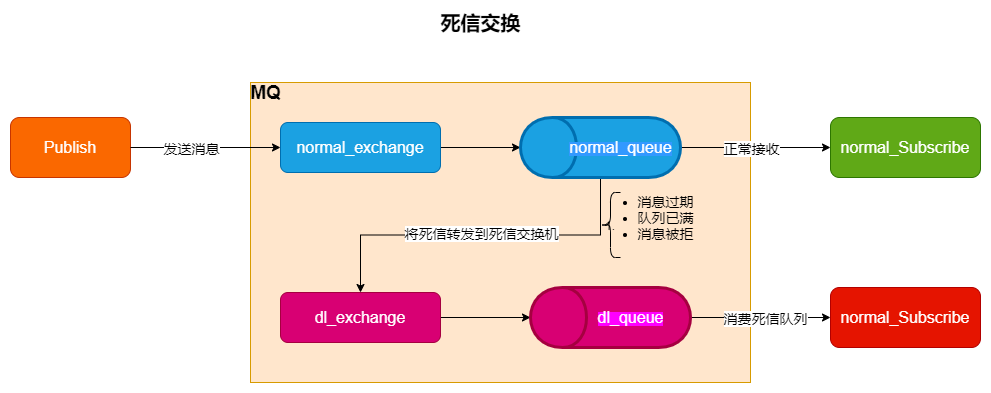
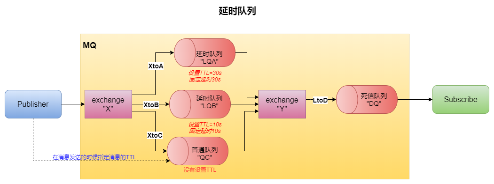
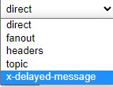
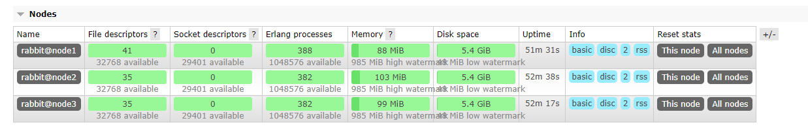
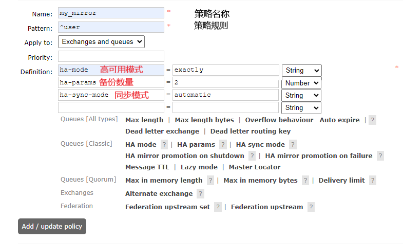

# RabbitMQ

## 一、初识MQ

官网地址：https://www.rabbitmq.com/tutorials/tutorial-one-java.html

了解RabbitMQ之前有必要了解什么是MQ、MQ的作用及一些相关的概念。

`MQ`：Message Queue，消息队列；也就是数据结构队列FIFO的一种体现，而消息队列就是对消息或数据处理的一个队列。

`优势/作用`：主要有如下

- 流量削峰：当服务器某时刻访问量激增导致服务器宕机的时候，MQ可对对流量进行限制以减小服务器压力。
- 应用解耦：作为一个中间件，将各个应用程序模块之间解耦，他们之间的交互通过MQ来实现。可以有效地防止故障牵连。
- 异步处理：当A服务调用B服务的时候不需要等待B的返回，而是交由MQ处理；当B处理完成之后会返回状态给MQ，再由MQ通知A其处理结果，这期间A可以做其他的事情，提高了效率。（典型的异步思想）

`常见的MQ`：

- Kafka：适用于大量数据的业务（大数据）
- RocketMQ：适用于高并发场景
- RabbitMQ：比较成熟，使用方便。

`概念`:

- 生产者：就是消息的发送者
- 消费者：就是消息的接收者
- 队列：中转消息的地方，接收生产者生产的消息并保存在队列中，基于FIFO原则被消费者取出消息。

`RabbitMQ`：是一个消息代理：**它接收和转发消息**。您可以将其视为邮局：当您要将投递的邮件放入邮箱时，您可以确定邮递员会将邮件送到收件人手上。而RabbitMQ在这里就是充当了邮箱、邮局、快递员的角色。只不过RabbitMQ传输的不是纸张而是二进制数据（消息）。——官网介绍


## 二、安装使用

**第一步**：官网下载相关包：

- rabbitMQ与Erlang的[版本对应](https://www.rabbitmq.com/which-erlang.html)
- [rabbitMQ包下载](https://github.com/rabbitmq/rabbitmq-server/releases)
- [Erlang包下载](https://github.com/rabbitmq/erlang-rpm/releases?page=2)

**第二部**：安装环境：

- 安装Erlang
  
  ```shell
  rpm -ivh ./erlang/erlang-23.3.4.6-1.el7.x86_64.rpm
  ```

- 安装依赖
  
  ```shell
   yum install socat -y
  ```

- 安装rabbitMQ
  
  ```shell
  rpm -ivh ./rabbitmq/rabbitmq-server-3.8.26-1.el7.noarch.rpm
  ```

**第三步**：启用RabbitMQ

- 开机时启动
  
  ```shell
  chkconfig rabbitmq-server on
  ```

- 启动服务
  
  ```shell
  /sbin/service rabbitmq-server start
  ```

- 查看服务状态
  
  ```shell
  /sbin/service rabbitmq-server status
  ```

- 停止服务
  
  ```shell
  /sbin/service rabbitmq-server stop
  ```

- 安装web可视化界面
  
  ```shell
  rabbitmq-plugins enable rabbitmq_management
  ```

- 重启rabbitmq
  
  ```shell
  service rabbitmq-server restart
  ```

**第四步**：用户访问

- 默认用户为guest，密码也是guest（只允许localhost连接）

- 如果安装了web可视化界面则可以使用浏览器访问：localhost:15672查看（非本地访问需要新建用户）

- 用户管理：[参考文档](https://www.rabbitmq.com/access-control.html)
  
  - 添加用户
    
    ```shell
    rabbitmqctl add_user "用户名"
    ```
  
  - 展示用户
    
    ```shell
    rabbitmqctl list_users
    ```
  
  - 删除用户
    
    ```shell
    rabbitmqctl delete_user '用户名'
    ```
  
  - 用户tag设置
    
    ```shell
    rabbitmqctl set_user_tags root administrator
    ```
  
  - 用户权限
    
    ```shell
    #第一个“.*”用于配置实体的权限
    #第二个“.*”表示对实体的写权限
    #第三个“.*” 用于读取物理的权限
    rabbitmqctl set_permissions -p "/"  "用户名"  ".*"  ".*"  ".*"
    ```

Web可视化界面登录


## 三、[Hello World](https://www.rabbitmq.com/tutorials/tutorial-one-python.html)

——The simplest thing that does something   简单的实现通信

使用java实现简单的生产者与消费者的通信

图示如下：


> 代码实现

**第一步**：依赖准备

```xml
<!--rabbitmq 依赖-->
<dependency>
    <groupId>com.rabbitmq</groupId>
    <artifactId>amqp-client</artifactId>
    <version>5.9.0</version>
</dependency>
<!--操作文件流的一个依赖-->
<dependency>
    <groupId>commons-io</groupId>
    <artifactId>commons-io</artifactId>
    <version>2.6</version>
</dependency>
```

**第二步**：生产者

主要步骤：

1. 获取连接
2. 创建通道和队列
3. 发送消息

```java
/**
 * 生产者
 */
public class Producer {

    // 队列名称
    private static final String QUEUE_NAME = "msgQueue";

    // 生产者生产发送消息
    public static void main(String[] args) throws Exception {
        // -------------------获取连接
        // 创建连接工厂
        ConnectionFactory factory = new ConnectionFactory();
        // 设置连接IP
        factory.setHost("192.168.1.117");
        // 设置连接用户
        factory.setUsername("root");
        // 设置连接密码
        factory.setPassword("root");
        // 创建连接
        Connection connection = factory.newConnection();

        // -----------------获取通道和队列
        // 获取通道
        Channel channel = connection.createChannel();
        /**
         * 生成队列,参数：
         *          1.队列名称；
         *          2.消息是否持久化;
         *          3.消息是对消费者否共享，即一个消息是否能被多个消费者消费
         *          4.是否自动删除
         *          5.其他参数
         */
        channel.queueDeclare(QUEUE_NAME,false,false,false,null);

        String msg = "Hello World";
        /**
         * 发送消息，参数：
         *             1.交换机
         *             2.路由的key值
         *             3.其他参数信息
         *             4.发送消息的消息体
         */
        channel.basicPublish("", QUEUE_NAME, null, msg.getBytes(StandardCharsets.UTF_8));

        System.out.println("消息发送完成");
    }
}
```

**第三步**：消费者

主要步骤：

1. 获取连接
2. 创建通道
3. 接收消息

```java
/**
 * 消费者
 */
public class Comsumer {

    // 队列名称
    private static final String QUEUE_NAME = "msgQueue";

    // 接收消息
    public static void main(String[] args) throws Exception {
        // 获取连接工厂
        ConnectionFactory factory = new ConnectionFactory();
        // 设置IP
        factory.setHost("192.168.1.117");
        // 设置用户
        factory.setUsername("root");
        // 设置密码
        factory.setPassword("root");
        // 获取连接
        Connection connection = factory.newConnection();

        // 获取通道
        Channel channel = connection.createChannel();

        /**
         * 消费队列中的消息
         *      1.消费的队列
         *      2.消费成功之后是否要自动应答
         *      3.消费成功的回调（函数式接口）
         *      4.消费者取消消费的回调（函数式接口）
         */
        channel.basicConsume(
                QUEUE_NAME,
                true,
                (consumerTsg,message)->{
                    System.out.println("tag：" + consumerTsg);
                    // 输出收到的消息
                    System.out.println("接收到消息：" + new String(message.getBody()));
                },
                cancel->{
                    System.out.println("消费消息取消");
                });
    }
}
```

**消息的发送和消费过程可以通过Web可视化界面查看**


## 四、[Work Queues](https://www.rabbitmq.com/tutorials/tutorial-two-java.html)

——Distributing tasks among workers (the competing consumers pattern) 

工作队列：队列中的消息被多个消费者消费。但是消费者之间是**竞争关系**，也就是每一个消息只能被消费一次。

图示如下：


> 代码实现

生产者：

```java
/**
 * 生产者
 */
public class Producer {
    // 队列名称
    private static final String QUEUE_NAME = "workQueues";

    public static void main(String[] args) throws Exception {
        // 通过工具类获取连接
        Channel channel = MQConnectionUtil.getChannel();
        /**
         * 生成队列,参数：
         *          1.队列名称；
         *          2.消息是否持久化;
         *          3.消息是对消费者否共享，即一个消息是否能被多个消费者消费
         *          4.是否自动删除
         *          5.其他参数
         */
        channel.queueDeclare(QUEUE_NAME,false,false,false,null);

        // 重复发送消息
        for (int i = 0; i < 5; i++) {
            /**
             * 发送消息，参数：
             *             1.交换机
             *             2.路由的key值
             *             3.其他参数信息
             *             4.发送消息的消息体
             */
            channel.basicPublish("", QUEUE_NAME, null, ("hello" + i).getBytes(StandardCharsets.UTF_8));
        }

        System.out.println("发送完成~");

    }
}
```

消费者：

```java
/**
 * 消费者1
 */
public class Consumer1 {
    // 队列名称
    private static final String QUEUE_NAME = "workQueues";

    public static void main(String[] args) throws Exception {
        // 工具类获取通道
        Channel channel = MQConnectionUtil.getChannel();

        // 接收消息
        channel.basicConsume(
                QUEUE_NAME,
                true,
                (consumerTsg,message)->{
                    System.out.println("consumer1 接收到消息：" + new String(message.getBody()));
                },
                cancel->{
                    System.out.println("consumer1 取消接收消息：" + cancel);
                });
    }
}
```

其他消费者同理。

结果查看：所有消费者会使用`轮询`的方式消费队列中的消息。

### 消息确认

当一个消费者接收到消息后进行了相应的处理的时候，由于处理的时间很长且只完成了部分的任务就死亡了，那么会导致该消息对应的任务并没有完成，而RabbitMQ中的消息会被标记为删除，因此导致了任务的丢失。

为了防止这种情况的出现，防止消息的的丢失，Rabbit提拱了[消息确认](https://www.rabbitmq.com/confirms.html)机制。主要有两种模式：

> **自动确认模式**

消息在发送后立即被视为成功投递。这种模式会牺牲更高的吞吐量（只要消费者能够跟上）以降低交付和消费者处理的安全性。这种模式通常被称为“即发即忘”。与手动确认模型不同，如果消费者的 TCP 连接或通道在成功传递之前关闭，则服务器发送的消息将丢失。因此，自动消息确认**应被视为不安全** 且不适用于所有工作负载。自动确认模式仅推荐用于能够以稳定的速度高效地处理交付的消费者。

> **手动确认模式**

 手动发送的确认可以是肯定的或否定的，并使用以下协议方法之一：

- basic.ack：用于肯定确认，表示该消息处理成功。
- basic.nack：用于否定确认，表示消息未处理，可以对信道中的消息进行批量应答。
- basic.reject：用于否定确认，表示消息未处理，只能单条应答。

代码实现：需要修改消息接收参数为手动应答（false）；在消息接收完成之后手动应答

```java
channel.basicConsume(
        QUEUE_NAME,
        // 设置为手动应答
        false,
        (consumerTsg,message)->{
            System.out.println("consumer1 接收到消息：" + new String(message.getBody()));
            /**
             * 进行手动应答操作
             *      参数1：对于那条参数应答
             *      参数2：是否批量应答，否
             */
            channel.basicAck(message.getEnvelope().getDeliveryTag(), false);
        },
        cancel->{
            System.out.println("consumer1 取消接收消息：" + cancel);
        });
```

> **做一个试验**

1. 有三个消费者1，2，3。
2. 其中1，2处理速度很慢（即确认应答很慢或者根本没有应答），而3的处理速度很快直接应答。可以使用用sleep实现。
3. 启动三个消费者之后，生产者发送5条消息。
4. 通过控制台发现三个消费者都有消息收到，但是查看Web可视化界面却发现有3条数据状态为Unacked。
5. 将1，2消费者关闭，发现3收到1，2处理的消息，同时Unacked的数据变为0.
6. 由此可以推断：当消费者由于某些原因导致无法返回消息确认时，RabbitMQ会将该消息重新入队交给其他正常的消费者进行处理。

### 重新入队

当消费者由于某些原因导致消息未能进行确认应答，则Rabbit就会了解到消息未完全处理，便将该消息重新放入到的队列中进行排队，被其他可用的消费者消费。

当消息重新排队时，如果可能，它将被放置在其队列中的原始位置；否则消息将重新排队到更靠近队列头的位置。

### 持久化

即便有了出现入队的机制保证任务不会丢失，但是如果时RabbitMQ服务器宕机了，那么队列中的消息就会全部丢失。

所以Rabbit提供了[持久化功能]()，将队列和消息都标记为持久的。

> **队列持久化**：队列指的是MQ中的一个组件，可以理解为存放消息的容器，所以队列持久化并不能同时持久化消息，需要额外设置。

```java
// 在生产者端，将声明队列方法的第二个参数改为true即表示开启持久化
boolean durable = true;
channel.queueDeclare("hello", durable, false, false, null);
```

 `注意：`对于已近创建的队列不能将其从非持久化改为持久化，需要新建队列或将原来的队列删除。

> **消息持久化**：

```java
// 在生产者端，消息持久化需要在消息发布的时候设置第三个参数为持久化
channel.basicPublish(
            // 交换机
            "", 
            // 队列名称
            "task_queue",
            // 消息持久化
            MessageProperties.PERSISTENT_TEXT_PLAIN,
            // 消息内容
            message.getBytes());
```

> 将消息标记为持久性并不能完全保证消息不会丢失。虽然它告诉 RabbitMQ 将消息保存到磁盘，但是当 RabbitMQ 已经接受一条消息并且还没有保存它时，仍然有一个很短的时间窗口。此外，RabbitMQ 不会对每条消息都执行fsync(2) —— 它可能只是保存到缓存中，而不是真正写入磁盘。持久性保证不强，但对于我们简单的任务队列来说已经足够了。如果您需要更强的保证，那么您可以使用 [发布确认](https://www.rabbitmq.com/confirms.html)。

### 公平分发

在默认情况下，一个队列的多个消费者之间是使用轮询的方式分发任务。但是在实际中并不适合这样，而是应该处理速度快的消费者处理跟多的消息以发挥其最极致的性能。

所以在Rabbit中提供了不公平任务分发策略，其核心思想是：**要求每次只给一个消费者分发一个任务，当其处理完成返回确认后，再为其分发下一个任务，这样就可以实现根据各个消费者的实际情况分发任务。**

```java
// 在消费者端，设置Qos为1就表示以非公平方式分发
int prefetchCount = 1;
channel.basicQos(prefetchCount);
```

**预取值**：预先分配每个消费者会从MQ中获取多少任务，消费者无论执行快慢都会执行完预先分配好的任务。

而上面的不公平分发就是预取值为1，也就是其核心思想——每次值分配一个任务。

### [发布确认](https://www.rabbitmq.com/confirms.html#publisher-confirms)

发布确认保证生产者再发送消息后被MQ持久化。如果没有发布确认就会出现：生产者发送了消息，但是在持久化过程中或者网络传输过程中出现问题，则也会导致消息的丢失。所以使用了发布确认，它模仿了消息接收确认机制。

由此可见：

- 发布确认是作用在Producer与MQ之间；
- 持久化是作用在MQ上；
- 消息确认是作用在MQ与Consumer之间。

> **启用发布确认**

```java
channel.confirmSelect();
```

发布确认共有三种模式：

> **单个确认**

 及发送一个消息等待确认一条消息。该方法时同步阻塞，所以效率比较低，但是安全性高。

```java
// 单个消息确认,在这里阻塞
// 每发送一次就进行一次确认
boolean flag = channel.waitForConfirms();
```

> **批量确认**

 先发布一批消息再一起进行确认。该方法速度较快，但是出现问题的时候无法定位到哪一个消息出现错误，就会导致这一批的消息都失败。

```java
// 每100条消息确认,在这里阻塞
if((i % 100) == 0){
    boolean flag = channel.waitForConfirms();
}
```

> **异步确认**

 通过`函数回调`来实现消息发送成功与否。生产者可以不断的发送消息，而MQ成功接收则会调用MQ的成功回调函数，失败则会调用失败的回调函数。这样就既可以保证发送的效率，有可以确保且精准的判断每一条消息是否发送成功。

 在发送消息之前开启一个监听器

```java
// 创建消息管理队列：存储未确认的消息且线程安全  key=消息的标识    value=消息内容
ConcurrentSkipListMap<Long, String> skipListMap = new ConcurrentSkipListMap<>();

// 开启发送确认监听器
channel.addConfirmListener(
                /**
                 * 发送成功回调
                 *      消息标识
                 *      是否为批量确认
                 */
                (tags, batch) -> {
                    // 此时的消息已确认，从map中删除
                    // 批量清除
                    // ConcurrentNavigableMap<Long, String> confirmed = skipListMap.headMap(tags);
                    // confirmed.clear();

                    // 非批量清除单条
                    skipListMap.remove(tags);
               },
                // 发送失败回调
                (tags, batch) -> {
                    // 未确认消息
                    String s = skipListMap.get(tags);
                    System.out.println("未确认: " + s);
                });


// 发送消息的时候将消息添加到map中
skipListMap.put(channel.getNextPublishSeqNo(), msg);
```


## 五、[ Publish/Subscribe](https://www.rabbitmq.com/tutorials/tutorial-three-python.html)

——Sending messages to many consumers at once.

一次向多个消费者发送消息。即，生产者发出的一条消息能被多个消费者消费，这与前面的两种模式有了本质的区别，所以将这种模式称为`"发布/订阅"`模式。

### 交换机

 在RabbitMQ中，生产者从来不直接将消息发送给队列，甚至不知道消息是否会被传送到任何队列。

 事实上，在RabbitMQ中，生产者会将消息发送给交换机，有交换机决定将消息发送给哪个队列。

 所以，交换机的主要功能有两个：

1. 接收生产者发送的消息。

2. 将消息推送给队列。
   
   交换机必须要知道如何处理接收到的消息，是添加到特定队列？是添加到每个队列？还是丢弃它们？
   
   交换机的类型主要有四种：**direct（直接）、topic（主体）、headers、fanout（扇出）**
   
   在发布/订阅模式中就是扇出类型，它会将收到的消息`广播`到所有队列，因此一条消息可以被多个消费者同时消费。
   
   在java中通过第一个参数指定消息将发送到哪个交换机：
   
   ```java
   // 消息将发送到名称为logs的交换机上
   channel.basicPublish( "logs" , "" , null , message.getBytes());
   ```

### 临时队列

 顾名思义，就是临时存在的队列。**临时队列的名称是随机的，不由开发者指定，且当消费者断开连接之后，队列就会自动被删除。**

 可以使用如下方式创建：

```java
// 获取一个临时队列
String queueName = channel.queueDeclare().getQueue();
```

### 绑定

 当有了扇出交换机和队列之后，就需要建立二者之间的关系。也就是告诉交换机需要将消息发送给哪些队列。

 

 使用忑如下方式实现：

```java
// 队列与交换机的绑定
channel.queueBind(queueName, "logs", "");
```

> 实现：


**Publish**：

```java
/**
 * 消息发布者
 */
public class Publish {

    // 交换机名称
    private static final String EXCHANGE_NAME = "logs";

    public static void main(String[] args) throws Exception {
        Channel channel = MQConnectionUtil.getChannel();
        // 设置交换机名称和扇出类型
        channel.exchangeDeclare(EXCHANGE_NAME, "fanout");

        /**
         * 发送消息
         *      交换机
         *      路由key
         *      其他参数
         *      消息
         */
        channel.basicPublish(EXCHANGE_NAME, "" ,null,"this is publish".getBytes());
        System.out.println("发送完成");
    }
}
```

**Subscribe**：

```java
/**
 * 订阅者1
 */
public class Subscribe1 {
    // 交换机名称
    private static final String EXCHANGE_NAME = "logs";

    public static void main(String[] args) throws Exception {
        Channel channel = MQConnectionUtil.getChannel();
        // 设置交换机名称和扇出类型
        channel.exchangeDeclare(EXCHANGE_NAME, "fanout");

        // 创建临时队列
        String queue = channel.queueDeclare().getQueue();

        /**
         * 交换机与队列的绑定:
         *            队列名称
         *            交换机名称
         *            路由key
         */
        channel.queueBind(queue, EXCHANGE_NAME, "");

        // 接收消息
        channel.basicConsume(
                // 队列名称
                queue,
                // 自动回复
                true,
                // 接受成功回调
                (tag,deliver)->{
                    System.out.println("Sub1接收到： " + new String(deliver.getBody()));
                },
                // 接收失败
                (str)->{ }
        );
    }
}
```


## 六、[Routing](https://www.rabbitmq.com/tutorials/tutorial-four-java.html)

——Receiving messages selectively

有选择性的接收消息

### 直接绑定

在发布订阅模式下交换机使用的是扇出模式，但是扇出模式是广播的形式，不够灵活。

所以有了直接绑定（direct）的模式。直接绑定可以为每个队列绑定自己的`routingKey`，之后交换机只会根据路由密钥将消息发送特定的队列中。


如上图：Q1队列只会收到orange下的消息；Q2只会收到black、green下的消息。

实现方式需要将交换机改为direct模式，且为队列绑定对应的routingKey。

消息接收：

```java
// 设置交换机模式为direct
channel.exchangeDeclare(EXCHANGE_NAME, "direct");
// 绑定routingKey，为第三个参数（也可以为一个队列绑定多个routingKey）
channel.queueBind(queueName, EXCHANGE_NAME, routingKey);
```

消息发送：

```java
// 在消息发布的时候，在第二个参数直送该消息的routingKey
channel.basicPublish(EXCHANGE_NAME,routingKey, null , message.getBytes());
```

### 多重绑定

在RabbitMQ中，多个队列绑定同一个routingKey是完全可以的。这种情况下就和扇出模式很像如下如：


Q1和Q2同时绑定了black的routingKey，所以二者可以同时收到black下的消息。

> 代码实现

**Publish**：

```java
/**
 * 消息发布者
 */
public class Publish {

    // 交换机名称
    private static final String EXCHANGE_NAME = "routing_logs";

    public static void main(String[] args) throws Exception {
        Channel channel = MQConnectionUtil.getChannel();
        // 设置交换机名称和直接类型
        channel.exchangeDeclare(EXCHANGE_NAME, "direct");

        // 发布消息并指定消息的routingKey
        channel.basicPublish(EXCHANGE_NAME, "info" ,null,"this is info log".getBytes());
        channel.basicPublish(EXCHANGE_NAME, "debug" ,null,"this is debug log".getBytes());
        channel.basicPublish(EXCHANGE_NAME, "warning" ,null,"this is warning log".getBytes());
        channel.basicPublish(EXCHANGE_NAME, "error" ,null,"this is error log".getBytes());
        System.out.println("发送完成");
    }
}
```

**Subscibe**：

```java
/**
 * 订阅者1
 */
public class Subscribe2 {

    // 交换机名称
    private static final String EXCHANGE_NAME = "routing_logs";

    public static void main(String[] args) throws Exception {
        Channel channel = MQConnectionUtil.getChannel();
        // 设置交换机名称和扇出类型
        channel.exchangeDeclare(EXCHANGE_NAME, "direct");

        // 创建临时队列
        String queue = channel.queueDeclare().getQueue();

        // 只接收warning、error下的消息
        channel.queueBind(queue, EXCHANGE_NAME, "warning");
        channel.queueBind(queue, EXCHANGE_NAME, "error");
        // 只接收info、debug下的消息
        // channel.queueBind(queue, EXCHANGE_NAME, "info");
        // channel.queueBind(queue, EXCHANGE_NAME, "debug");

        // 接收消息
        channel.basicConsume(
                // 队列名称
                queue,
                // 自动回复
                true,
                // 接受成功回调
                (tag,deliver)->{
                    System.out.println("Sub2接收到： " + new String(deliver.getBody()));
                },
                // 接收失败
                (str)->{ }
        );
    }
}
```

绑定结果：


## 七、 [Topics](https://www.rabbitmq.com/tutorials/tutorial-five-python.html)

——Receiving messages based on a pattern (topics)

基于主体模式接收消息。

在direct模式下，不能基于多个标准进行路由。对于复杂的场景中将很难实现消息的发布于订阅。

因此有了**主题交换机**，它于直接交换类似，但是它的routingKey有不再是任意的，而是一个单词列表，单词之间以"."分隔。比如：user.info、user.debug、goods.list.info等。routingKey可以有任意多个单词，最多 255 个字节。

主题模式下，对于routingkey有两种特殊的情况：

- "*"  可以代替一个词。
- "#" 可以代替零个或多个词。


如上图所示：

表示Q1只会接收到由三个单词组成routingKey的消息且第二个单词必须是orange；

Q2会收到由三个单词组成的routingKey的消息且最后一个单词为rabbit；还会接收到以lazy开头的任意长度的routingKey。

**思考：**

- 当接收消息的routingKey为“#”时，就是**扇出**模式，任意一个消费者都能收到；
- 当接收消息的routingKey不使用"*"和"#"时，就是**直接**模式，只能接收特定的消息。

> 代码实现

代码整体结构与Routing类似，需要修改模式以及routingKey

**Publish**：

```java
// 设置交换机名称和主题类型
channel.exchangeDeclare(EXCHANGE_NAME, "topic");

// 发布消息并指定消息的routingKey
channel.basicPublish(EXCHANGE_NAME, "user.list.info" ,null,"{users: tom,jerry}".getBytes());
channel.basicPublish(EXCHANGE_NAME, "user.save.debug" ,null,"add user ---> lucy".getBytes());
channel.basicPublish(EXCHANGE_NAME, "goods.list.page.info" ,null,"page=1,size=10,{....}".getBytes());
channel.basicPublish(EXCHANGE_NAME, "goods.update.debug" ,null,"update phoneNum to 123456789".getBytes());
```

**Subscribe**：

```java
// 设置交换机名称和扇出类型
channel.exchangeDeclare(EXCHANGE_NAME, "topic");

// 接收所有user相关的日志
channel.queueBind(queue, EXCHANGE_NAME, "user.#");
// 接收所有list相关日志
channel.queueBind(queue, EXCHANGE_NAME, "*.list.*");
```

绑定结果：


## 八、扩展

###  [死信队列](https://www.rabbitmq.com/dlx.html)

死信：即由于某些原因导致无法被消费的消息就称之为死信。

为了保证消息的不丢失，便提供了死信队列用于存放这些消息。

产生死信的原因主要如下：

- 消息TTL过期

- 队列达到最大长度（队列放满了）

- 消息被拒（消费者使用basic.reject或basic.nack并且将requeue参数设置为false）

工作流程如下图所示：



当发送消息的时候，正常情况下是由normal_queue交给normal_subscribe消费；但是由于一些原因导致无法被正常消费，这时就会标记这些消息为死信，并将其转发到死刑交换机上，在由死信交换机将消息分配给死信队列，最后由特定的消费者处理死信队列中下消息，保证了消息的不丢失。

> 代码实现

**Normal_Subscribe**：

```java
/**
 * 一般消费者
 */
public class NormalConsumer {
    // 一般交换机
    private static final String NORMAL_EXCHANGE = "normal_exchange";
    // 死信交换机
    private static final String DL_EXCHANGE = "dl_exchange";
    // 一般队列
    private static final String NORMAL_QUEUE = "normal_queue";

    // 接收消息
    public static void main(String[] args) throws Exception {
        Channel channel = MQConnectionUtil.getChannel();

        // 声明一般交换机
        channel.exchangeDeclare(NORMAL_EXCHANGE, BuiltinExchangeType.DIRECT);
        // 声明死信交换机
        channel.exchangeDeclare(DL_EXCHANGE, BuiltinExchangeType.DIRECT);

        // 作为队列声明的参数
        HashMap<String, Object> arguments = new HashMap<>();
        // 设置出现死信队列之后将死信转发到哪个交换机上（死信交换机）
        arguments.put("x-dead-letter-exchange", DL_EXCHANGE);
        // 设置死信队列的routingKey
        arguments.put("x-dead-letter-routing-key", "dead.letter");

        /**
         * 声明一个死信队列
         * 参数：
         *      队列名称
         *      是否持久化
         *      消息是否共享
         *      是否自动删除
         *      一些参数：以map的形式传入
         */
        channel.queueDeclare(NORMAL_QUEUE,false,false,false,arguments);

        // 将一般交换机与一般队列绑定
        channel.queueBind(NORMAL_QUEUE, NORMAL_EXCHANGE, "");

        // 接收消息
        channel.basicConsume(
                NORMAL_QUEUE,
                true,
                (tags, message)->{
                    System.out.println("接收到消息: " + new String(message.getBody()));
                },
                tags->{
                    // todo sth
                });
    }
}
```

**DL_Subscribe**：

```java
/**
 * 死信消费者
 */
public class DLConsumer {
    // 死信交换机
    private static final String DL_EXCHANGE = "dl_exchange";
    // 死信队列
    private static final String DL_QUEUE = "dl_queue";


    public static void main(String[] args) throws Exception {
        Channel channel = MQConnectionUtil.getChannel();

        // 声明一个死信队列
        channel.queueDeclare(DL_QUEUE,false,false,false,null);
        // 将死信交换机与死信队列绑定；routingKey为normal队列中设置的routingKey
        channel.queueBind(DL_QUEUE, DL_EXCHANGE, "dead.letter");

        // 消费死信队列中的消息
        channel.basicConsume(
                DL_QUEUE,
                true,
                (tag,message)->{
                    System.out.println("接收到死信： " + new String(message.getBody(),"UTF-8"));
                },
                (tag)->{

                });
    }
}
```

**Publisher**：

```java
/**
 * 死信队列的生产者
 */
public class Publish {
    // 一般交换机
    private static final String NORMAL_EXCHANGE = "normal_exchange";

    public static void main(String[] args) throws Exception {
        Channel channel = MQConnectionUtil.getChannel();
        // 发送正常消息
//        channel.basicPublish(NORMAL_EXCHANGE, "", null, "normal letter test".getBytes());

        // 构建一个参数
        AMQP.BasicProperties properties =
                new AMQP.BasicProperties()
                        .builder()
                        // 过期时间10s
                        .expiration("10000").build();
        // 发送死信消息
        channel.basicPublish(NORMAL_EXCHANGE, "", properties, "dead letter test".getBytes());
    }
}
```

结果为：

- 正常情况下由Normal消费者消费消息；
- 当出现死信后，死信会转发到死信队列，并由DL消费者消费。


### 延时队列


使用场景：

- 订单在30分钟内未支付则自动取消

- 用户注册成功后，一段时间内未登录则短信提醒

> TTL
>

TTL：Time To Live的缩写，即表示存活的时间。在RabbitMQ队列中的消息存在时间比配置的TTL长即为死信。

在RabbitMQ中有多种当时设置TTL：

1. 在声明期间定义消息TTL（队列中的消息最多存活设定时间）

   ```java
   // 创建一个map存放参数
   Map<String, Object> args = new HashMap<String, Object>();
   // 设置队列中的消息存活时间为6s
   args.put("x-message-ttl", 60000);
   // 在声明期间设置消息的TTL
   channel.queueDeclare("myqueue", false, false, false, args);
   ```

2. 在发布者中定义每条消息的TTL

   ```java
   // 使用BasicProperties构建一个附加参数
   AMQP.BasicProperties properties = new AMQP.BasicProperties.Builder()
       								// 设置每条消息的TTL为6s
                                      .expiration("60000")
                                      .build();
   // 发布时携带参数以设定TTL
   channel.basicPublish("my-exchange", "routing-key", properties, messageBodyBytes);
   ```

3. 在声明期间定义队列的TTL（消息在设定时间内没有被消费即过期）

   ```java
   Map<String, Object> args = new HashMap<String, Object>();
   // 设置
   args.put("x-expires", 1800000);
   channel.queueDeclare("myqueue", false, false, false, args);
   ```

> 实现方式
>

如下图：



延时队列的核心设计思想为：

- 先将消息发送到指定的队列中（A\B\C）;
- 设置队列的TTL 或者 消息发送时设置消息的TTL（后者可以**灵活**的设置**一个队列**中消息的延时时间）；
- 当消息在队列中过期之后就会进入死信队列，然后由死信队列的消费消费消息就可以达到延时的效果。
- 代码可查看Springboot整合中的`6.LazyQueues`相关代码

`注意`：在消息生产者处设置TTL的方法存在问题——队列中的消息是按顺序的，也就是只有当前一个消息被消费（处理）之后才能消费下个一个消息。

例如：连续发送两个消息m1、m2；m1延时30s，m2延时10s。预期结果为10s后收到m2，30s后收到m1。但是结果却是30s后收到m1，又立刻收到m2——即m2被m1阻塞了。


> 使用插件实现延时队列
>

RabbitMQ插件库：https://www.rabbitmq.com/community-plugins.html

github地址：https://github.com/rabbitmq/rabbitmq-delayed-message-exchange/releases

- 使用插件实现需要先准备好插件：rabbitmq_delayed_message_exchange-3.8.9-0199d11c.ez

- 将插件放置到：/usr/lib/rabbitmq/lib/rabbitmq_server-3.8.26/plugins目录下

- 安装插件，使用命令：rabbitmq-plugins enable rabbitmq_delayed_message_exchange

- 重启MQ

- 安装完成之后MQ中就会出现新的交换机类型：x-delayed-message

  

- 因此，该方法延时的实现方法是**通过交换机实现**的

**使用该方式可以避免上面阻塞的问题。**

代码实现可见SpringBoot整合`7演示队列（插件实现）`


### [优先级队列](https://www.rabbitmq.com/priority.html)

任何队列都可以使用客户端提供的[可选参数](https://www.rabbitmq.com/queues.html#optional-arguments)转换为优先队列 。该实现支持有限数量的优先级：255。建议使用 1 到 10 之间的值。（因为数字大消耗CPU）

- 声明队列时，通过附加参数参数设置：

  ```java
  Map<String, Object> arguments = new HashMap<String, Object>();
  // 设置队列优先级
  arguments.put("x-max-priority", 10);
  QueueBuilder.durable(NORMAL_QUEUE_C).withArguments(arguments).build();
  ```

- 发送消息的时候为消息设置：

  ```
  // 发送消息
  rabbitTemplate.convertAndSend(
          // 交换机
          DelayByPluginConfig.DELAY_EXCHANGE,
          // 路由键
          DelayByPluginConfig.DELAY_KEY,
          // 消息
          "消息发送时间：" + new Date().toString(),
          // 参数设置(是一个函数时接口)
          message -> {
              // 设置消息的延时时长
              MessageProperties messageProperties = message.getMessageProperties();
              // 设置消息优先级
              messageProperties.setPriority(5);
              return message;
          }
  );
  ```


### [惰性队列]((https://www.rabbitmq.com/lazy-queues.html))

**懒惰队列**的概念——队列尽可能早地将它们的内容移动到磁盘，并且只在消费者请求时才将它们加载到 RAM 中。

主要目标之一是能够支持非常长的队列。由于各种原因，队列可能会变得非常长：

- 消费者离线、宕机、维护等；

- 生产者突然发送大量消息，消费者来不及消费；

- 消费者比平时慢等。

默认情况下，队列在消息发布到 RabbitMQ 时保留消息的内存缓存，该缓存已填满。这个缓存的想法是能够尽可能快地将消息传递给消费者。请注意，持久消息可以在进入代理时写入磁盘**并同时**保存在 RAM 中。

```java
 Map<String, Object> args = new HashMap<String, Object>();
args.put( "x-queue-mode" , "lazy" );
```

### 幂等性

幂等性：指任意多次执行所产生的影响与一次产生的影响一致。

常见问题：重复消费。

解决：

- 唯一ID+指纹码机制
- Redis原子性，使用`setnx`命令


## 九、[集群](https://www.rabbitmq.com/clustering.html)

### 环境搭建

1. 准备三台服务器（分别命名：node1、node2、node3）

   ```shell
   vi /etc/hostname
   ```

2. 配置各个节点的hosts文件

   vi /etc/hosts

   192.168.1.118 node1
   192.168.1.254 node2
   192.168.1.160 node3

3. 确保各个节点的cookie文件相同

   ```shell
   # 将node1的cookie远程复制给其他节点
   scp /var/lib/rabbitmq/.erlang.cookie root@node2:/var/lib/rabbitmq/.erlang.cookie
   scp /var/lib/rabbitmq/.erlang.cookie root@node3:/var/lib/rabbitmq/.erlang.cookie
   ```

4. 重启MQ

   ````shell
    rabbitmq-server -detached
   ````

5. 将节点加入集群

   ```shell
   # 关闭mq服务
   rabbitmqctl stop_app
   rabbitmqctl reset
   # 将该节点加入到node1中，注意防火墙关闭
   rabbitmqctl join_cluster rabbit@node1
   rabbitmqctl start_app
   ```

6. 查看集群状态

   ````shell
   rabbitmqctl cluster_status
   
   # 出现如下结果表示成功
   Disk Nodes
   
   rabbit@node1
   rabbit@node2
   rabbit@node3
   
   Running Nodes
   
   rabbit@node1
   rabbit@node2
   rabbit@node3
   ````

7. 创建集群用户，角色权限

   ```shell
   # 创建admin用户
   rabbitmqctl add_user admin admin
   # 添加角色标签
   rabbitmqctl set_user_tags admin administrator
   # 添加权限
   rabbitmqctl set_permissions -p "/" admin ".*" ".*" ".*"
   ```

8. Web可化登录

   

9. 节点脱离集群

   ```shell
   rabbitmqctl stop_app
   rabbitmqctl reset
   rabbitmqctl start_app
   rabbitmqctl cluster_status
   # 该命令需要在主机上执行
   rabbitmqctl forget_cluster_node rabbit@node2
   ```

   

### [镜像队列](https://www.rabbitmq.com/ha.html)

什么是镜像队列？

- 在集群搭建好之后，当消息发送到node1中队列时，只有node1中的队列保存了该消息；当node1宕机后，而其他节点上又没有备份，就会导致消息丢失。因此需要使用**镜像**来复制领导节点的队列，称之为镜像队列。

如何配置？

- 可以使用策略来配置。策略配置详情查看[官网](https://www.rabbitmq.com/parameters.html#policies)。

- 例如Web方式：Admin -> Policies -> add/update a policy

  


## Springboot整合

整合代码相关示例可见GitHub

> 依赖

```xml
<!--RabbitMQ相关-->
<dependency>
    <groupId>org.springframework.boot</groupId>
    <artifactId>spring-boot-starter-amqp</artifactId>
</dependency>
```

> 配置

```yml
spring:
  # rabbitmq相关配置
  rabbitmq:
    host: 192.168.1.118
    port: 5672
    username: root
    password: root
```

> 使用

- 使用@Configuration配置类创建队列（Queue）、交换机（Exchange）和绑定（Binding）。
- 使用@RabbitListener(queues = "queueName")来接收消息。
- 使用RabbitTemplate来发送消息。

> 示例

[👉Github地址](https://github.com/wuraoo/springboot-demo/tree/master/rabbitmq/springboot-rabbitmq/src/main/java/com/zjj/rabbitmq)

1. HelloWorld：简单的发送消息
2. WorkQueues：竞争消费（轮询）
3. Publish/Subscribe(Fanout)：扇出（广播）
4. Routing(Direct)：路由指定
5. Topic：可以是使用通配符"#"、"*"进行指定routingKey
6. LazyQueues：延时队列（通过TTL和死信队列实现）
7. 延时队列（插件实现）：能够解决6中出现的问题


